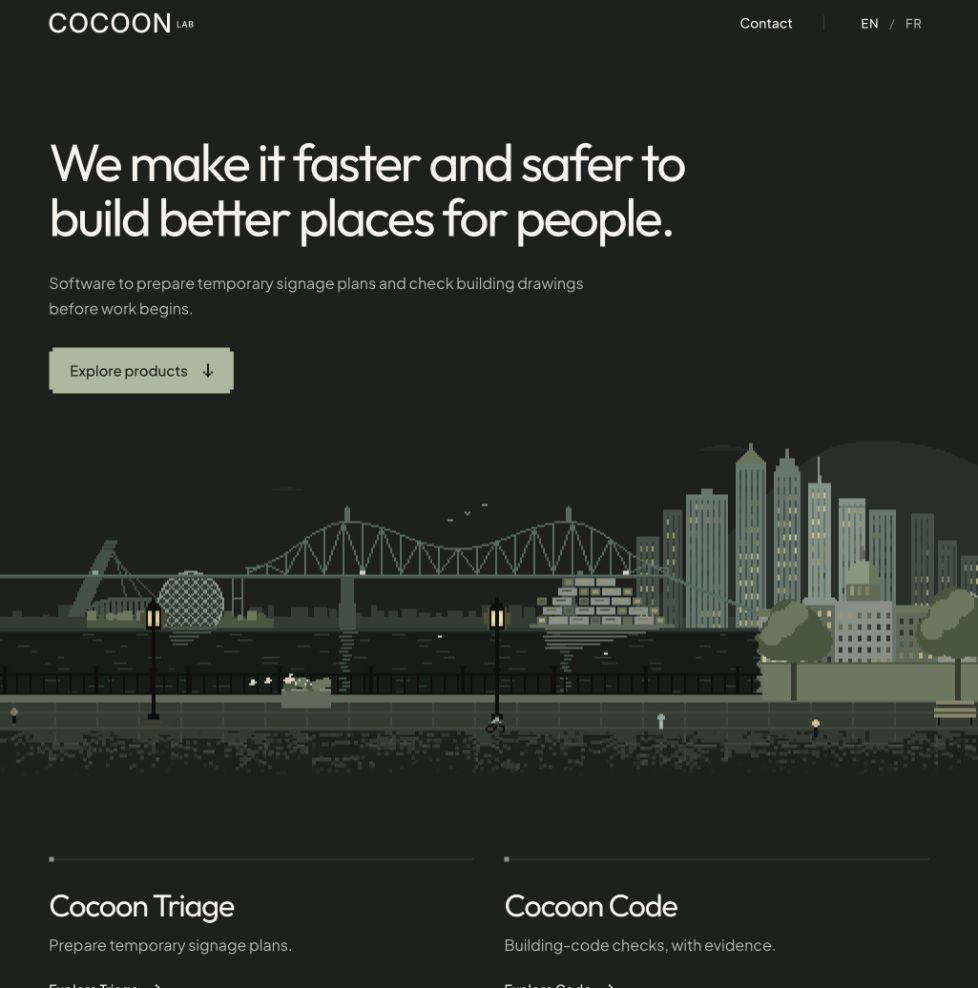
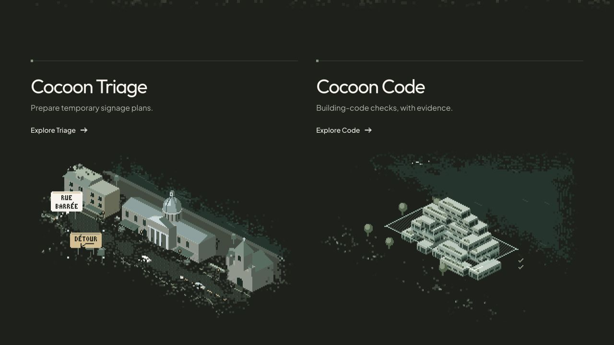

# Approved dark pixel design

The approved design is the default on every route; no preview parameter or theme switch is required.

- Dark olive, ivory, sage, and warm lantern light carry the brand palette.
- The Montréal waterfront has a quieter bridge and coordinated building and lantern lighting.
- Triage depicts signage preparation on Rue Saint-Paul: a construction closure and RUE BARRÉE sign at the left end, with an adjacent DÉTOUR sign and a functioning side-street detour.
- Code shows a luminous scan through Habitat 67.
- Seeded Conway cells gently gather and dissolve source pixels at the illustration edges. The architecture settles and remains readable.
- Reduced motion holds a settled frame. Animation pauses when the document or scene is hidden.

## Review

Run `npm run dev`, then view `/`, `/triage/`, and `/code/`. Switch between English and French (the French pages are under `/fr/`). Screenshots show individual moments of the live animation.

## Validation

- `npm run lint`
- `npm run build`, including all 14 prerendered routes
- Default dark document metadata on all prerendered routes
- Browser checks for English/French, cookie preferences, both product pages, and clear runtime/hydration error logs
- Animation source bounds, finite opacity, changing frames, and deterministic reduced-motion frame
